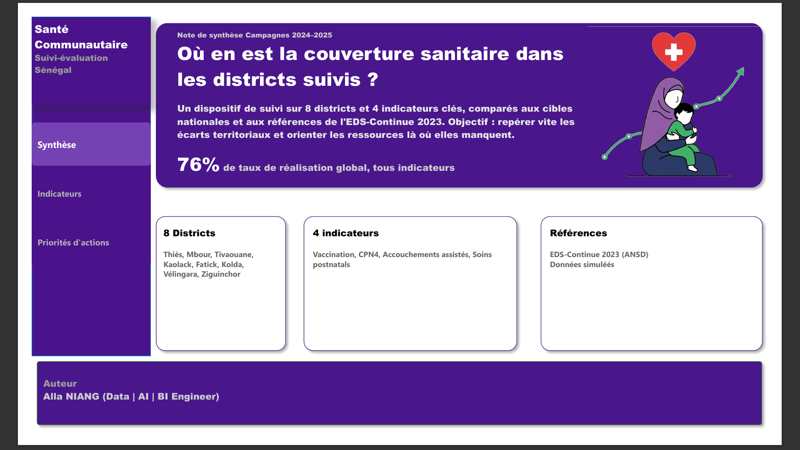
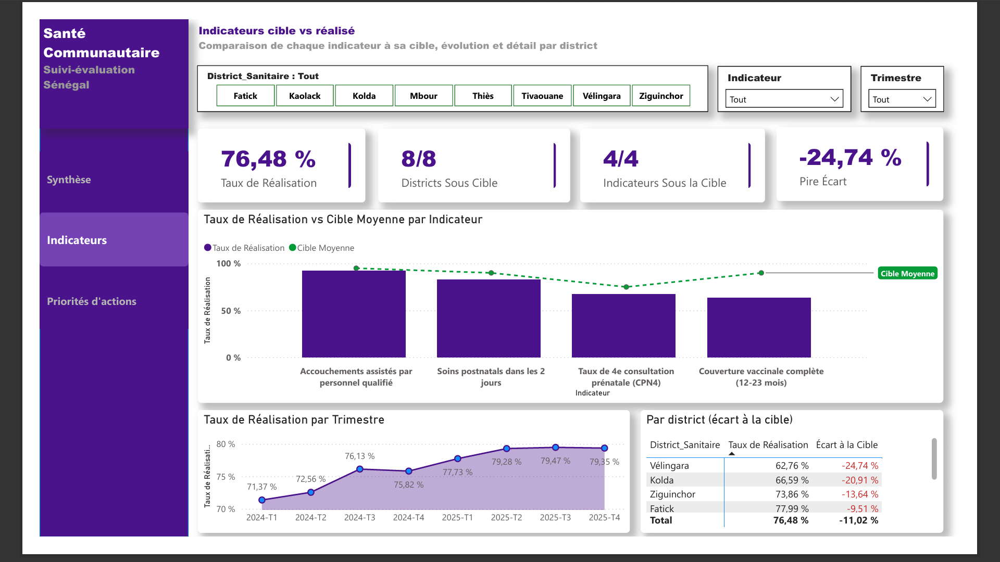
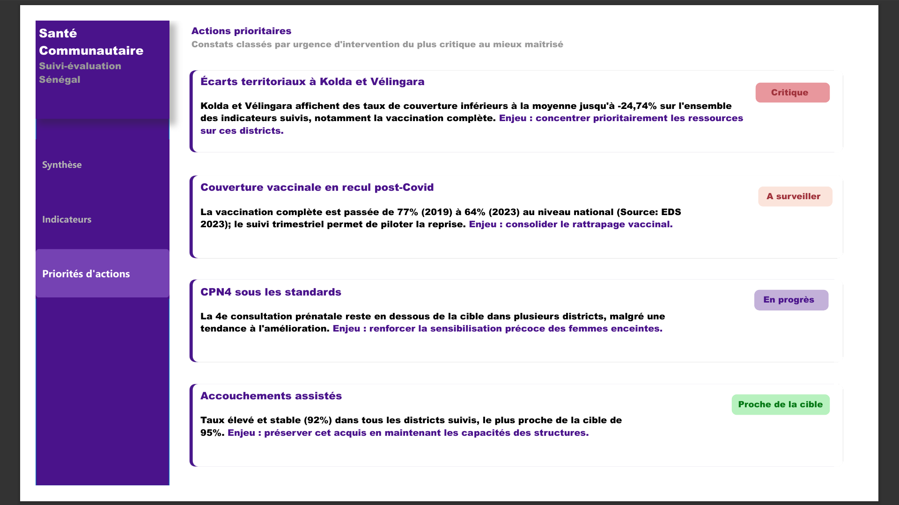

# Dashboard Power BI Suivi-évaluation santé communautaire (Sénégal)

Dispositif de **suivi-évaluation cadre logique** (cible vs réalisé) pour un programme de santé communautaire. Le rapport compare la couverture sanitaire de 8 districts à des cibles nationales, pour repérer les écarts territoriaux et orienter les ressources.

> Références EDS-Continue 2023 (ANSD) + données de programme simulées et anonymisées.

**Auteur :** [Alla NIANG](https://github.com/niangalla) - Data | AI | BI Engineer

---

## Aperçu

| Synthèse | Indicateurs |
|---|---|
|  |  |



---

## Périmètre

| Dimension | Valeur |
|---|---|
| Période | 2024 - 2025 (8 trimestres) |
| Districts | Thiès, Mbour, Tivaouane, Kaolack, Fatick, Kolda, Vélingara, Ziguinchor |
| Indicateurs | Vaccination complète (12–23 mois), CPN4, accouchements assistés, soins postnatals (2 jours) |
| Taux de réalisation global | 76,48 % |
| Granularité | District × indicateur × trimestre |

**Question de pilotage :** où en est la couverture sanitaire dans les districts suivis, et où concentrer l'appui ?

---

## Structure du rapport

1. **Synthèse** - question de pilotage, périmètre, sources, taux de réalisation global
2. **Indicateurs** - KPI, barres vs ligne de cible, évolution trimestrielle, tableau d'écarts par district
3. **Priorités d'actions** - constats classés par urgence (Critique / À surveiller / En progrès / Proche de la cible)

Filtres : **District sanitaire**, **Indicateur**, **Trimestre**.

---

## Modèle de données

Deux tables, une relation plusieurs-à-un :

```
Suivi_Indicateurs[District_Sanitaire]  *1  Districts[District_Sanitaire]
```

Pas de table calendrier : `Trimestre` (`2024-T1`, …) sert d'axe chronologique. Un ordre numérique (`Annee * 10 + numéro de trimestre`) garantit le tri correct.

**Suivi_Indicateurs** : indicateur, cible (%), trimestre, année, population cible, nombre atteint.

**Districts** : district sanitaire, région de rattachement, population totale.

L'onglet **Sources** du classeur Excel documente les références nationales. Il n'est pas importé dans le modèle.

---

## Indicateurs DAX

```dax
Taux de Réalisation =
DIVIDE(SUM(Suivi_Indicateurs[Nombre_Atteint]), SUM(Suivi_Indicateurs[Population_Cible]))

Cible Moyenne = AVERAGE(Suivi_Indicateurs[Cible_Pourcentage]) / 100

Écart à la Cible = [Taux de Réalisation] - [Cible Moyenne]

Population Couverte = SUM(Suivi_Indicateurs[Nombre_Atteint])

Nombre d'Indicateurs Sous la Cible =
CALCULATE(
    DISTINCTCOUNT(Suivi_Indicateurs[Indicateur]),
    FILTER(
        VALUES(Suivi_Indicateurs[Indicateur]),
        CALCULATE([Taux de Réalisation]) < CALCULATE([Cible Moyenne])
    )
)
```

Mise en forme conditionnelle sur **Écart à la Cible** : rouge si négatif, vert si positif.

---

## Insights clés

| Priorité | Constat | Enjeu |
|---|---|---|
| Critique | Kolda et Vélingara jusqu'à **−24,74 %** sous la moyenne, surtout en vaccination | Concentrer les ressources sur ces districts |
| À surveiller | Vaccination complète nationale passée de **77 % (2019)** à **64 % (2023)** | Consolider le rattrapage vaccinal |
| En progrès | CPN4 encore sous la cible dans plusieurs districts | Sensibiliser dès le 1er trimestre de grossesse |
| Proche de la cible | Accouchements assistés **stables à 92 %** (cible 95 %) | Préserver l'acquis |

---

## Sources

Références nationales EDS-Continue 2023 (ANSD) :

| Indicateur | Référence 2023 |
|---|---|
| Couverture vaccinale complète (12–23 mois) | 64 % |
| 4e consultation prénatale (CPN4) | 68 % |
| Accouchements assistés par personnel qualifié | 93,5 % |
| Soins postnatals | 83 % |

La variation par district est une estimation plausible autour de ces bases nationales.

Détail dans `data/Programme_Sante_Communautaire_Senegal_DEMO.xlsx`, onglet **Sources**.

---

## Contenu du dépôt

```
├── README.md
├── data/            Classeur Excel (Suivi_Indicateurs, Districts, Sources)
├── powerbi/         Fichier .pbix
├── screenshots/     Captures des 3 pages
└── docs/            Export PDF du rapport
```

---

## Ouvrir le rapport

1. Installer [Power BI Desktop](https://www.microsoft.com/fr-fr/download/details.aspx?id=58494)
2. Ouvrir `powerbi/Suivi-Evaluation_Programme_Sante_Communautaire.pbix`
3. Si les données doivent être rechargées : **Obtenir les données → Classeur Excel** → `data/Programme_Sante_Communautaire_Senegal_DEMO.xlsx` → tables **Suivi_Indicateurs** et **Districts**

---

## Licence

Données de démonstration, à usage pédagogique et portfolio. Ne pas présenter comme un programme réel.
